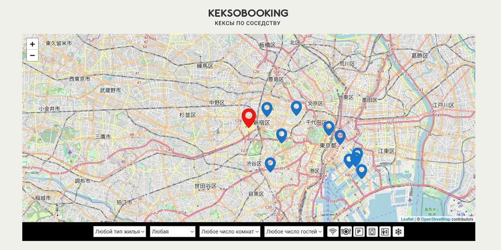

# Проект «Кексобукинг» от [HTML Academy](https://htmlacademy.ru/)

Кексобукинг — сервис размещения объявлений о сдаче в аренду недвижимости в центре Токио. Пользователям предоставляется возможность размещать объявления о своей недвижимости или просматривать уже размещённые объявления.

Программирование: [Андрей Грачев](https://github.com/andreysgra/)

[Демо проекта](https://andreysgra.github.io/keksobooking/)

## Используемый стек

JavaScript (ES6), ES Modules.

[Техническое задание](Specification.md)

---

## Как использовать

`npm install` - установка зависимостей.

`npm start` - сборка проекта в режиме разработки и запуск локального сервера.

`npm run lint` - запуск теста на соответствие правилам ESLint.
